# Storage Domain

## Overview

The Storage domain contains templates, checklists, and reference materials for the LLM & Agentic Rules Framework.

## Architecture

```mermaid
flowchart TD
    A[Storage] --> B[Rule Templates]
    A --> C[Checklist Templates]
    A --> D[Evaluation Templates]
    A --> E[Incident Templates]
    A --> F[Architecture Templates]
    A --> G[Domain Rules]
    
    B --> B1[Fundamentals Template]
    B --> B2[Best Practices Template]
    B --> B3[Anti-Patterns Template]
    B --> B4[Checklist Template]
    B --> B5[Examples Template]
    B --> B6[Troubleshooting Template]
    B --> B7[Advanced Template]
    
    C --> C1[Release Checklist]
    C --> C2[Security Checklist]
    C --> C3[Data Governance Checklist]
    C --> C4[Testing Checklist]
    C --> C5[Operations Checklist]
    
    D --> D1[Evaluation Plan]
    D --> D2[Evaluation Report]
    D --> D3[Safety Evaluation]
    D --> D4[Quality Evaluation]
    D --> D5[Performance Evaluation]
    
    E --> E1[Incident Report]
    E --> E2[Response Runbook]
    E --> E3[Post-Incident Review]
    E --> E4[Emergency Response]
    
    F --> F1[ADR Template]
    F --> F2[Design Document]
    F --> F3[System Register]
    F --> F4[Threat Model]
    
    G --> G1[Core Domain Rules]
    G --> G2[Security Domain Rules]
    G --> G3[Data Domain Rules]
    G --> G4[Testing Domain Rules]
    G --> G5[Compliance Domain Rules]
```

## Files

| File | Purpose | Lines |
|------|---------|-------|
| rule-templates.md | Rule file templates | 1259 |
| checklist-templates.md | Checklist templates | 802 |
| evaluation-templates.md | Evaluation templates | 841 |
| incident-templates.md | Incident templates | 805 |
| architecture-templates.md | Architecture templates | 935 |
| core-domain-rules.md | Core domain rules | 1223 |
| security-domain-rules.md | Security domain rules | 1049 |
| data-domain-rules.md | Data domain rules | 992 |
| testing-domain-rules.md | Testing domain rules | 1118 |
| compliance-domain-rules.md | Compliance domain rules | 1294 |

## Quick Start

1. Use `rule-templates.md` for creating new rules
2. Reference `checklist-templates.md` for verification steps
3. Use `evaluation-templates.md` for evaluation setup
4. Reference `incident-templates.md` for incident response
