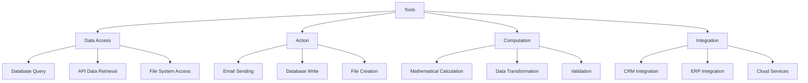
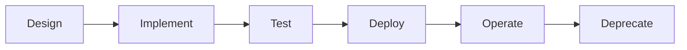

# Tools Domain

## Overview

The Tools domain provides comprehensive guidance for integrating tools in LLM and agentic systems.

## Architecture

```mermaid
flowchart TD
    A[Tools Domain] --> B[Fundamentals]
    A --> C[Best Practices]
    A --> D[Anti-Patterns]
    A --> E[Checklist]
    A --> F[Examples]
    A --> G[Troubleshooting]
    A --> H[Advanced]
    
    B --> B1[Tool Concepts]
    B --> B2[Tool Categories]
    B --> B3[Tool Components]
    
    C --> C1[Least Privilege]
    C --> C2[Error Handling]
    C --> C3[Audit Logging]
    
    D --> D1[Overly Broad Permissions]
    D --> D2[No Error Handling]
    D --> D3[Missing Audit]
    
    E --> E1[P0 Critical Checks]
    E --> E2[P1 High Priority]
    E --> E3[P2 Medium Priority]
    
    F --> F1[Database Tool]
    F --> F2[Email Tool]
    F --> F3[API Tool]
    
    G --> G1[Issue Diagnosis]
    G --> G2[Solutions]
    
    H --> H1[Orchestration]
    H --> H2[Composition]
    H --> H3[Security]
```

## Tool Categories

## Tool Lifecycle

## Files

| File | Purpose | Lines |
|------|---------|-------|
| tools-fundamentals.md | Core tool concepts | 472 |
| tools-best-practices.md | Recommended patterns | 366 |
| tools-anti-patterns.md | Common mistakes | 392 |
| tools-checklist.md | Verification steps | 264 |
| tools-examples.md | Practical examples | 354 |
| tools-troubleshooting.md | Issue solutions | 503 |
| tools-advanced.md | Advanced techniques | 482 |

## Quick Start

1. Read `tools-fundamentals.md` for core concepts
2. Review `tools-best-practices.md` for recommended patterns
3. Use `tools-checklist.md` for verification steps
4. Reference `tools-examples.md` for implementation guidance
