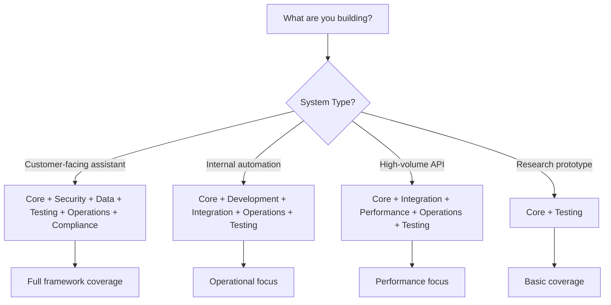
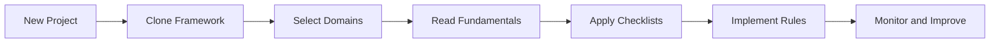
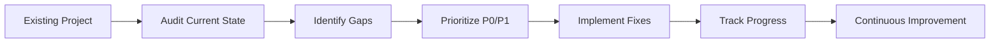

# Usage Guide - LLM & Agentic Rules Framework

## Overview

This guide shows how to use the LLM & Agentic Rules Framework in your AI projects.

## Quick Start

### Step 1: Clone and Setup

```bash
# Clone the repository
git clone https://github.com/Lifejiggy/llm-agentic-rules-framework.git
cd llm-agentic-rules-framework

# Run setup
python scripts/setup.py --all
```

### Step 2: Select Your Domains



### Step 3: Read Fundamentals

```bash
# Read core fundamentals
less domains/01-core/fundamentals.md

# Read domain-specific fundamentals
less domains/02-security/fundamentals.md
less domains/07-testing/fundamentals.md
```

### Step 4: Use Checklists

```bash
# Export all checklists
python scripts/cli.py export --output my-checklists.md

# Or use specific domain checklists
less domains/01-core/checklist.md
less domains/02-security/checklist.md
```

## Usage Patterns

### Pattern 1: New Project



**Steps**:
1. Clone the framework repository
2. Select domains based on system risk
3. Read core fundamentals for your domains
4. Apply relevant checklists during development
5. Implement rules as you build
6. Monitor compliance and improve continuously

### Pattern 2: Existing Project



**Steps**:
1. Audit current implementation against domain checklists
2. Identify gaps in P0 and P1 controls
3. Prioritize fixes based on risk
4. Implement fixes incrementally
5. Track progress with metrics
6. Continue improving over time

### Pattern 3: CI/CD Integration

```yaml
# .github/workflows/framework-validation.yml
name: Framework Validation
on: [push, pull_request]

jobs:
  validate:
    runs-on: ubuntu-latest
    steps:
      - uses: actions/checkout@v4
      - name: Setup Python
        uses: actions/setup-python@v4
        with:
          python-version: '3.9'
      - name: Validate Framework
        run: python scripts/cli.py validate
      - name: Generate Report
        run: python scripts/cli.py report --format json --output report.json
      - name: Export Checklists
        run: python scripts/cli.py export --output checklists.md
```

## Domain Usage

### Core Domain

**When to use**: Always - foundational for all AI systems

```bash
# Read fundamentals
less domains/01-core/fundamentals.md

# Apply checklist
less domains/01-core/checklist.md
```

**Key Rules**:
- Document system ownership and purpose
- Assign risk tier
- Implement human review for high-impact actions
- Test fallback and rollback capabilities

### Security Domain

**When to use**: All production systems

```bash
# Read fundamentals
less domains/02-security/fundamentals.md

# Apply checklist
less domains/02-security/checklist.md
```

**Key Rules**:
- Conduct threat modeling
- Implement input validation
- Configure output filtering
- Manage secrets securely

### Testing Domain

**When to use**: All systems requiring quality assurance

```bash
# Read fundamentals
less domains/07-testing/fundamentals.md

# Apply checklist
less domains/07-testing/checklist.md
```

**Key Rules****
- Define evaluation coverage thresholds
- Maintain regression test suite
- Include safety tests
- Establish performance benchmarks

## Module Usage

### Evaluation Module

**When to use**: Before releases and during monitoring

```bash
# Read fundamentals
less evaluation/evaluation-fundamentals.md

# Apply checklist
less evaluation/evaluation-checklist.md
```

**Key Workflows**:
- Pre-release evaluation
- Continuous monitoring
- Incident response evaluation
- Model update evaluation

### Incident Response Module

**When to use**: For production incident handling

```bash
# Read fundamentals
less incident-response/incident-response-fundamentals.md

# Apply checklist
less incident-response/incident-response-checklist.md
```

**Key Workflows**:
- Detection and triage
- Containment and remediation
- Post-mortem and learning

### Deployment Module

**When to use**: For CI/CD and release management

```bash
# Read fundamentals
less deployment/deployment-fundamentals.md

# Apply checklist
less deployment/deployment-checklist.md
```

**Key Workflows**:
- Blue-green deployment
- Canary deployment
- Rollback procedures

## Agent Usage

### Rules Architect

**When to use**: During system design

```bash
less agents/rules-architect.md
```

**Responsibilities**:
- Design system architecture
- Select applicable domains
- Define risk tier
- Create architecture decision records

### Rules Reviewer

**When to use**: During code review

```bash
less agents/rules-reviewer.md
```

**Responsibilities**:
- Review code against framework rules
- Identify findings and issues
- Provide remediation guidance
- Generate review reports

### Rules Release Gate

**When to use**: Before production release

```bash
less agents/rules-release-gate.md
```

**Responsibilities**:
- Evaluate release readiness
- Validate evidence packages
- Make release decisions
- Track exceptions

## CLI Usage

### Check System

```bash
python scripts/cli.py check
```

### Validate Framework

```bash
python scripts/cli.py validate --verbose
```

### Generate Report

```bash
python scripts/cli.py report --format markdown
```

### Export Checklists

```bash
python scripts/cli.py export --output checklists.md --filter P0
```

### Install Adapters

```bash
# List targets
python scripts/cli.py list

# Install for specific target
python scripts/cli.py install --target claude-code --apply
```

## Integration Examples

### With GitHub Copilot

```bash
# Install adapter
python scripts/cli.py install --target github-copilot --apply

# This creates .github/copilot-instructions.md with framework guidance
```

### With Cursor

```bash
# Install adapter
python scripts/cli.py install --target cursor --apply

# This creates .cursorrules with framework rules
```

### With Claude Code

```bash
# Install adapter
python scripts/cli.py install --target claude-code --apply

# This configures Claude Code with framework skills and agents
```

## Best Practices

### 1. Start Small

- Begin with core domain
- Add domains incrementally
- Focus on P0 and P1 rules first

### 2. Integrate Early

- Add framework to CI/CD pipeline
- Use checklists in code reviews
- Apply rules during design phase

### 3. Track Progress

- Use metrics to measure compliance
- Review findings regularly
- Update rules based on learnings

### 4. Share Knowledge

- Document framework usage
- Share best practices with team
- Contribute improvements back

## Troubleshooting

### Common Issues

| Issue | Solution |
|-------|----------|
| Framework too complex | Start with core domain only |
| Rules too strict | Use P2/P3 rules as guidelines |
| Integration difficult | Use CLI and adapters |
| Team resistance | Show value through examples |

### Getting Help

```bash
# Check framework status
python scripts/cli.py check

# Validate framework
python scripts/cli.py validate

# Generate report
python scripts/cli.py report
```

## Conclusion

The LLM & Agentic Rules Framework provides flexible usage patterns for teams of all sizes and maturity levels. Start with what you need and grow into the full framework over time.
