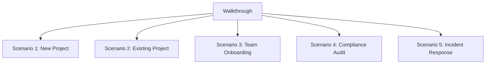
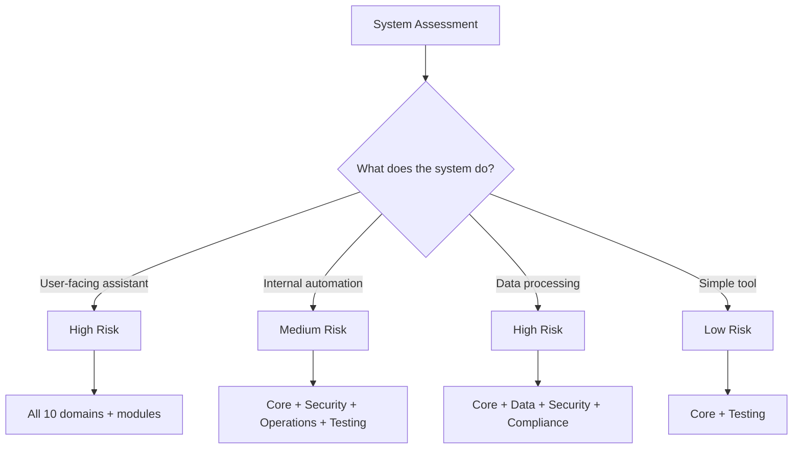
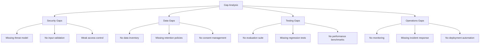
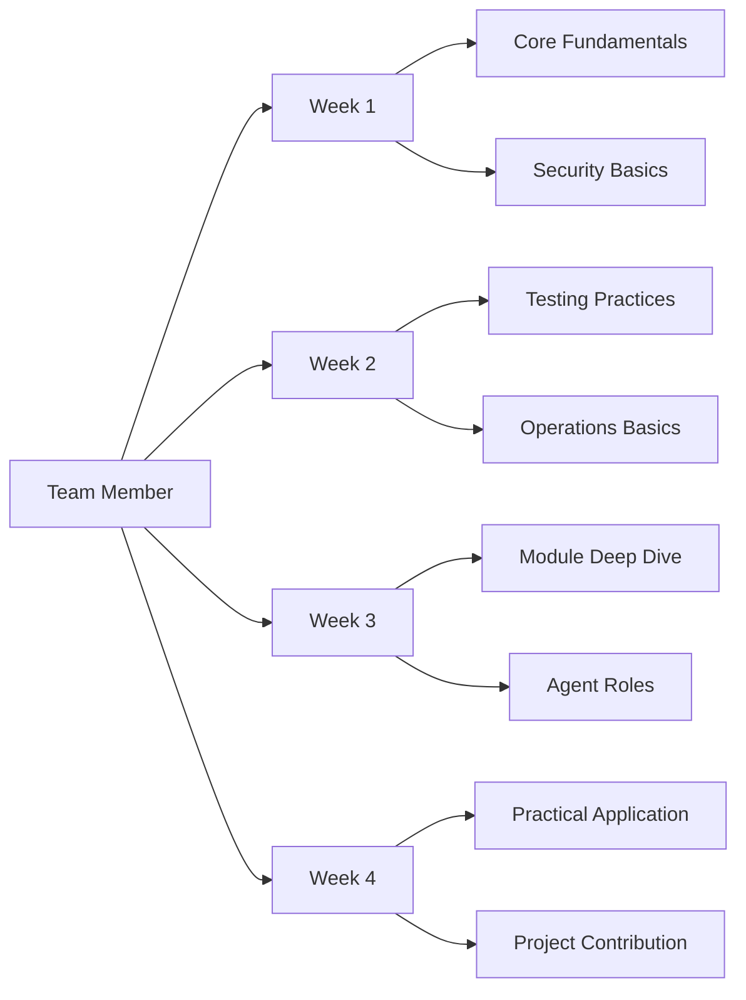
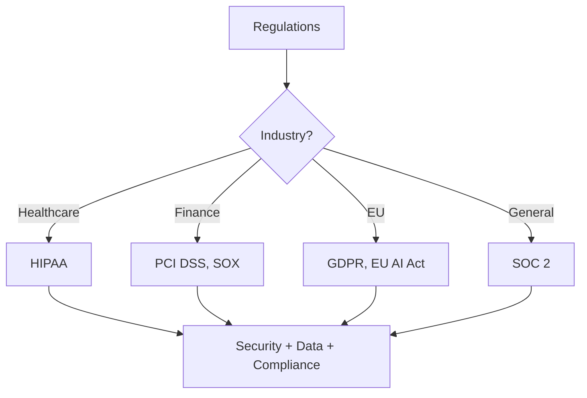
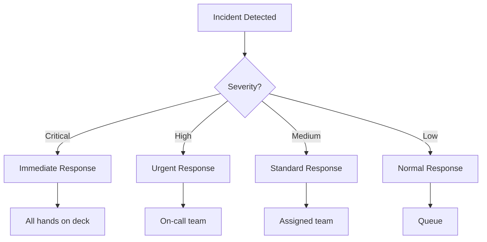

# Walkthrough - LLM & Agentic Rules Framework

## Overview

This walkthrough provides a step-by-step guide to implementing the LLM & Agentic Rules Framework in your project.

## Walkthrough Scenarios



## Scenario 1: New Project Setup

### Step 1: Clone and Initialize

```bash
# Clone the framework
git clone https://github.com/Lifejiggy/llm-agentic-rules-framework.git
cd llm-agentic-rules-framework

# Run setup
python scripts/setup.py --all
```

**What happens**:
- System requirements validated
- Dependencies installed
- Framework structure verified
- Configuration created

### Step 2: Assess System Risk



**Questions to answer**:
1. Who uses this system?
2. What data does it process?
3. What decisions does it make?
4. What happens if it fails?

### Step 3: Select Domains

```bash
# For a customer-facing assistant
# Required: Core, Security, Data, Testing, Operations, Compliance

# Read core fundamentals first
less domains/01-core/fundamentals.md

# Then read security fundamentals
less domains/02-security/fundamentals.md
```

### Step 4: Apply Checklists

```bash
# Export relevant checklists
python scripts/cli.py export --output project-checklists.md --filter P0

# Review the checklists
less project-checklists.md
```

### Step 5: Design System

```bash
# Read architecture guidance
less domains/01-core/best-practices.md

# Use Rules Architect agent
less agents/rules-architect.md
```

**Design activities**:
1. Document system purpose and ownership
2. Assign risk tier
3. Select applicable domains
4. Define control requirements
5. Create architecture decision records

### Step 6: Implement Rules

```bash
# Read implementation guidance
less domains/03-development/best-practices.md

# Use Rules Implementer agent
less agents/rules-implementer.md
```

**Implementation activities**:
1. Implement P0 controls first
2. Add P1 controls
3. Write tests
4. Document implementation
5. Collect evidence

### Step 7: Review and Release

```bash
# Read review guidance
less domains/07-testing/checklist.md

# Use Rules Reviewer agent
less agents/rules-reviewer.md

# Use Rules Release Gate agent
less agents/rules-release-gate.md
```

**Review activities**:
1. Run evaluation suite
2. Review against framework rules
3. Collect evidence
4. Make release decision
5. Deploy with monitoring

## Scenario 2: Existing Project Audit

### Step 1: Audit Current State

```bash
# Export all checklists
python scripts/cli.py export --output audit-checklists.md

# Review current implementation against checklists
less audit-checklists.md
```

### Step 2: Identify Gaps



### Step 3: Prioritize Fixes

| Priority | Gap | Impact | Effort |
|----------|-----|--------|--------|
| P0 | Missing threat model | High | Medium |
| P0 | No input validation | High | Low |
| P1 | No data inventory | Medium | Medium |
| P1 | No evaluation suite | Medium | High |
| P2 | No monitoring | Low | Medium |

### Step 4: Implement Fixes

```bash
# Start with P0 security gaps
less domains/02-security/fundamentals.md
less domains/02-security/best-practices.md

# Implement incrementally
# Track progress with checklists
```

### Step 5: Track Progress

```bash
# Generate progress report
python scripts/cli.py report --format markdown

# Review metrics
less progress-report.md
```

## Scenario 3: Team Onboarding

### Step 1: Share Framework Overview

```bash
# Share README
less README.md

# Share goal and purpose
less goal.md
less purpose.md
```

### Step 2: Assign Reading Path



### Step 3: Pair Programming

```bash
# Pair on implementing a rule
less domains/02-security/best-practices.md

# Implement together
# Review together
# Document learnings
```

### Step 4: Review and Feedback

```bash
# Review team member's implementation
less agents/rules-reviewer.md

# Provide constructive feedback
# Track improvement
```

## Scenario 4: Compliance Audit Preparation

### Step 1: Identify Regulations



### Step 2: Map Requirements

```bash
# Read compliance domain
less domains/10-compliance/fundamentals.md

# Read governance module
less governance/governance-fundamentals.md
```

### Step 3: Collect Evidence

```bash
# Read evidence requirements
less domains/10-compliance/checklist.md

# Use Rules Compliance Auditor agent
less agents/rules-compliance-auditor.md
```

### Step 4: Prepare Documentation

```bash
# Use templates
less assets/templates/ai-system-register.yml
less assets/templates/compliance-review.md
less assets/templates/compliance-evidence-pack.md
```

### Step 5: Conduct Internal Audit

```bash
# Use governance module
less governance/governance-checklist.md

# Address findings
# Document remediation
```

## Scenario 5: Incident Response

### Step 1: Detect Incident



### Step 2: Triage and Contain

```bash
# Read incident response fundamentals
less incident-response/incident-response-fundamentals.md

# Use incident response runbook
less assets/templates/incident-runbook.md
```

### Step 3: Investigate and Remediate

```bash
# Read troubleshooting guidance
less incident-response/incident-response-troubleshooting.md

# Investigate root cause
# Implement fix
# Test fix
```

### Step 4: Post-Mortem

```bash
# Read post-mortem process
less incident-response/incident-response-best-practices.md

# Conduct blameless post-mortem
# Document learnings
# Implement improvements
```

### Step 5: Follow-Up

```bash
# Track action items
# Implement preventive measures
# Update runbooks
# Share learnings
```

## Tips for Success

### 1. Start Small

- Begin with one domain
- Master basics before advancing
- Build confidence gradually

### 2. Be Consistent

- Apply rules consistently
- Use templates and checklists
- Track compliance regularly

### 3. Collaborate

- Share knowledge with team
- Review each other's work
- Contribute improvements

### 4. Measure Progress

- Track metrics over time
- Celebrate improvements
- Address gaps promptly

### 5. Continuous Learning

- Stay updated with framework changes
- Learn from incidents
- Share best practices

## Conclusion

This walkthrough provides practical guidance for implementing the LLM & Agentic Rules Framework in various scenarios. Adapt the steps to your specific context and needs.
